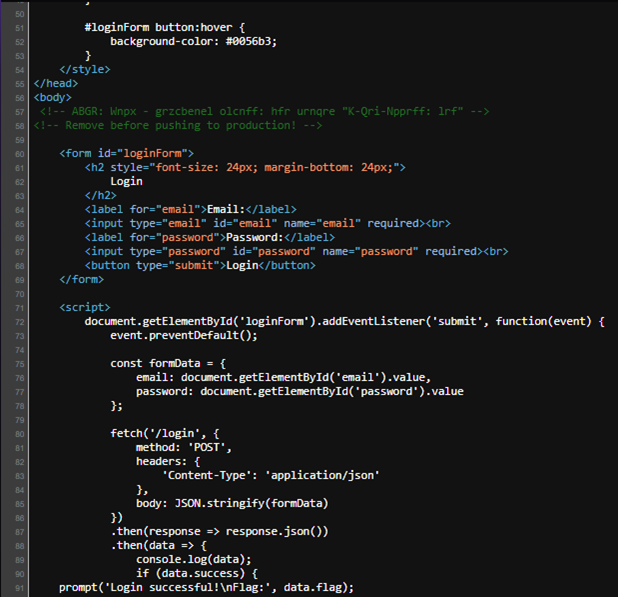
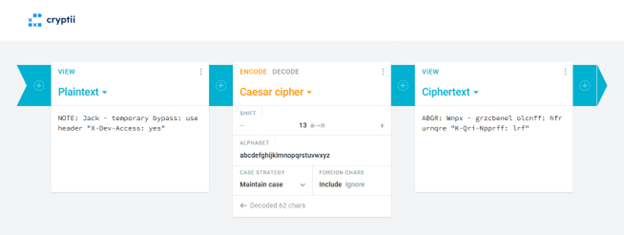
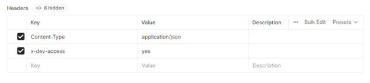
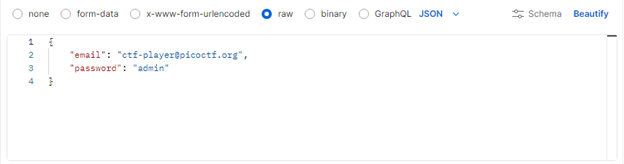
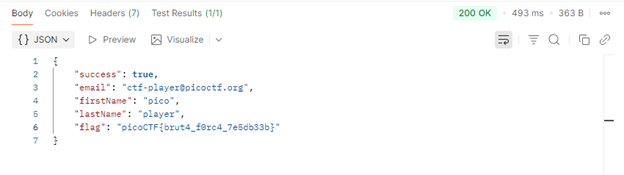

<div align="center">

# Crack the Gate 1 – Web Authentication Bypass via Hidden Developer Header

**Author:** Alex Ngo  


</div>

---

## 1. Challenge Information

| Field | Details |
|---|---|
| **Platform** | PicoCTF |
| **Category** | Web Exploitation |
| **Difficulty** | Easy |
| **Link** | https://play.picoctf.org/practice/challenge/520 |
| **Vulnerability Type** | Authentication Bypass (Improper Access Control) |
| **Primary Issues** | Hidden Developer Header |

**Related Standards:**
- OWASP A01: Broken Access Control
- CWE-284: Improper Access Control

---

## 2. Executive Summary

During a simulated investigation into a restricted web portal, a critical authentication bypass vulnerability was discovered. The application improperly exposed sensitive developer notes within the HTML source code, which contained obfuscated instructions for bypassing the authentication mechanism.

By leveraging this exposed information and injecting a custom HTTP header, unauthorized access was successfully achieved and sensitive data (the flag) was extracted. This report details the discovery, exploitation, and recommended remediation for this vulnerability.

---

## 3. Reconnaissance & Enumeration

- The target web application presented a basic login interface requiring an email and password.
- Initial testing with arbitrary credentials resulted in an `"Invalid credentials"` response, indicating standard authentication enforcement.
- Further inspection using browser developer tools (**View Page Source**) revealed hidden HTML comments:

```html
<!-- ABGR: Wnpx - grzcbenel olcnff: hfr urnqre "K-Qri-Npprff: lrf" -->
<!-- Remove before pushing to production! -->
```



- This indicated the presence of potentially sensitive information unintentionally exposed in the client-side code.
- The encoded string appeared to follow a substitution pattern. Based on its structure, **ROT13** (a common Caesar cipher variant used in CTF challenges) was tested.

Decoding the string revealed:

```
NOTE: Jack - temporary bypass: use header 'X-Dev-Access: yes'
```



This message confirms the existence of a **developer backdoor mechanism** implemented via a custom HTTP header.

---

## 4. Exploitation & Attack Vector

The identified backdoor was exploited by crafting a custom HTTP request.

A `POST` request was sent to the `/login` endpoint using **Postman** with the following header:

```
X-Dev-Access: yes
```

Request body:

```json
{
  "email": "ctf-player@picoctf.org",
  "password": "admin"
}
```



The server responded with **HTTP 200 OK** and returned the flag, confirming that the authentication mechanism was bypassed.





**Flag:** `picoCTF{brut4_forc4_7e5db33b}`

This confirms that the server-side logic improperly trusts a client-supplied header to grant privileged access.

---

## 5. Root Cause Analysis

The vulnerability exists due to multiple compounding design failures:

### 5.1. Developer Backdoor Left in Production
- A temporary bypass mechanism (`X-Dev-Access: yes`) was introduced during development and never removed before deployment.
- No process existed to audit or strip debug/dev features before going live.

### 5.2. Sensitive Information Exposed in Client-Side Code
- Developer notes were embedded directly in HTML as comments, visible to any user who views the page source.
- Even though the content was ROT13-encoded, ROT13 provides zero cryptographic security and is trivially reversible.

### 5.3. Trust of Client-Controlled HTTP Headers for Auth Decisions
- The server granted elevated access based solely on the presence of an HTTP header (`X-Dev-Access: yes`).
- HTTP headers are fully client-controlled — any user can add arbitrary headers to their requests.
- This violates the fundamental principle that **authentication decisions must never rely on client-supplied data without server-side verification**.

### 5.4. Lack of Access Control Enforcement
- No secondary validation (e.g., session token, IP allowlist, secret key) was required alongside the bypass header.
- The backdoor provided a direct path to privileged access with no audit trail.

### 5.5. Absence of Security Review Process
- The comment explicitly states `<!-- Remove before pushing to production! -->`, indicating awareness of the risk — yet it was still deployed.
- This points to a missing or ineffective pre-deployment security review and code scanning process.

---

## 6. Remediation & Best Practices

### 1. Remove All Developer Backdoors Before Deployment
- Enforce a checklist or automated scan to detect and block debug routes, bypass headers, and dev-only features before any production release.

### 2. Never Expose Sensitive Information in Client-Side Code
- Strip all HTML comments, debug annotations, and internal notes during the build process.
- Use linters and CI pipeline checks to catch accidental exposure.

### 3. Implement Strict Server-Side Access Control
- Never use client-controlled inputs (headers, cookies, query params) as the sole basis for authentication or authorization decisions.
- Apply server-side session management and role-based access control (RBAC).

### 4. Do Not Rely on Obscurity for Security
- ROT13 and similar encodings are not encryption. Treat any client-visible data as fully public.

### 5. Conduct Secure Code Reviews and Penetration Testing
- Integrate SAST (Static Application Security Testing) tools into the CI/CD pipeline.
- Perform regular penetration testing and include authentication bypass as a test case.

### 6. Implement Logging and Monitoring
- Log all authentication attempts, including those using non-standard headers.
- Alert on anomalous request patterns to detect exploitation attempts early.

### 7. Follow OWASP Secure Coding Practices
- Reference [OWASP Authentication Cheat Sheet](https://cheatsheetseries.owasp.org/cheatsheets/Authentication_Cheat_Sheet.html) and [OWASP Access Control Cheat Sheet](https://cheatsheetseries.owasp.org/cheatsheets/Access_Control_Cheat_Sheet.html).
