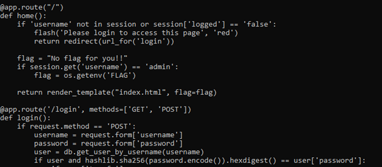
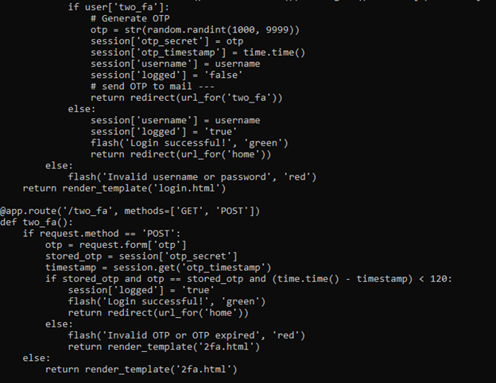
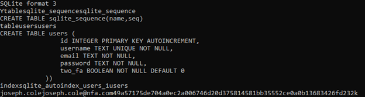
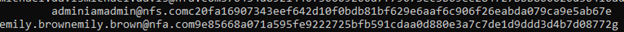
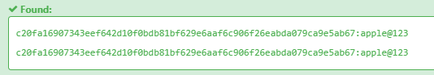
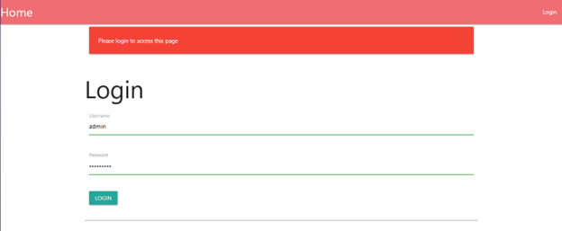
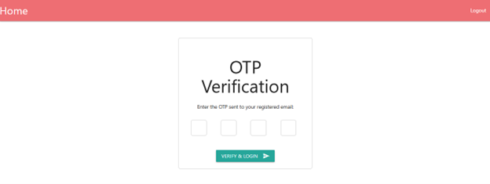
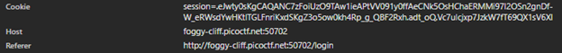
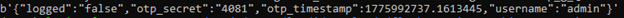
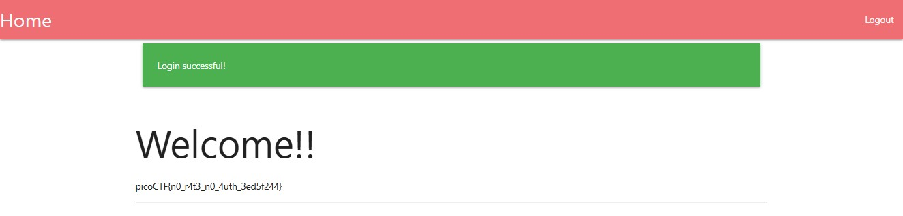

# NO FA – Authentication Bypass via Leaked Credentials & Weak 2FA Implementation

**Author:** Alex Ngo  
**Platform:** PicoCTF  
**Category:** Web Exploitation  
**Difficulty:** Medium  

---

## 1. Challenge Information

| Field | Details |
|---|---|
| **Platform** | PicoCTF |
| **Category** | Web Exploitation |
| **Difficulty** | Medium |
| **Link** | https://play.picoctf.org/practice/challenge/765 |
| **Vulnerability Type** | Authentication Bypass |
| **Primary Issues** | Weak Two-Factor Authentication (2FA) & Sensitive Data Exposure |

**Related Standards:**
- OWASP A01: Broken Access Control
- OWASP A02: Cryptographic Failures
- CWE-287: Improper Authentication
- CWE-522: Insufficiently Protected Credentials

---

## 2. Executive Summary

This challenge demonstrates a critical authentication bypass caused by a combination of **leaked credential data** and **insecure 2FA implementation**.

An attacker can extract hashed credentials from a provided database file and recover the admin password using publicly available hash databases. Although 2FA is implemented, it is fundamentally flawed: the One-Time Password (OTP) is stored client-side within a Flask session cookie. By decoding the session cookie, the attacker can retrieve the OTP without brute force, effectively bypassing the second authentication factor.

This vulnerability highlights improper handling of authentication mechanisms and failure to securely manage sensitive data, leading to full account compromise.

---

## 3. Reconnaissance & Enumeration

The challenge provides:
- A target web application
- Source code (`app.py`)
- Database file (`users.db`)

### 3.1. Source Code Analysis

Reviewing `app.py` reveals:
- Authentication logic for user login
- Admin account grants access to the flag
- Passwords are stored using SHA-256 hashing



- A 2FA mechanism is implemented for certain users

If a user has `two_fa = TRUE`, they are redirected to: `/two_fa`

### 3.2. 2FA Mechanism Analysis

The OTP generation logic contains several weaknesses:
- OTP range: **1000–9999** (only 9000 possible values)
- OTP is stored inside a **Flask session cookie**
- Session is sent back to the client

> This indicates **client-side exposure of sensitive authentication data**.



### 3.3. Database Analysis

The `users.db` file was analyzed using:

```bash
strings users.db
```

This revealed:
- Usernames
- SHA-256 hashed passwords

The admin account hash was successfully identified.




---

## 4. Exploitation & Attack Vector

### 4.1. Credential Recovery

The extracted SHA-256 hash was submitted to an online hash database:  
https://hashes.com

The plaintext password for the admin account was successfully recovered.



### 4.2. Initial Authentication

Using the recovered credentials:

| Field | Value |
|---|---|
| **Username** | `admin` |
| **Password** | `apple@123` |

Login was successful, but redirected to the 2FA verification page.




### 4.3. Session Cookie Analysis

Using browser Developer Tools (Network tab), the session cookie was inspected.



Key observations:
- Cookie starts with `"."` → Flask session format
- Structure consists of 3 parts:
  1. Encoded payload (contains OTP)
  2. Timestamp
  3. Digital signature

The payload is:
- Base64 encoded
- Compressed using zlib

### 4.4. OTP Extraction

A public tool was used to decode the Flask session:  
https://github.com/noraj/flask-session-cookie-manager

```bash
python3 flask_session_cookie_manager.py decode -c <SESSION_COOKIE>
```

Decoded payload revealed:



### 4.5. 2FA Bypass

The extracted OTP was entered into the 2FA verification page.

Authentication successful — flag retrieved.



---

## 5. Root Cause Analysis

The vulnerability exists due to multiple critical design flaws:

### 5.1. Sensitive Data Exposure
- Credentials stored in an accessible database file
- Weak protection of password hashes

### 5.2. Broken 2FA Implementation
- OTP stored client-side in session cookie
- No server-side validation integrity

### 5.3. Insecure Session Design
- Predictable structure
- Decodable without secret key protection

### 5.4. Weak OTP Design
- Low entropy (4-digit numeric only)

---

## 6. Remediation & Best Practices

### 6.1. Secure Credential Storage
- Use strong hashing algorithms (e.g., bcrypt, Argon2)
- Never expose database files publicly

### 6.2. Proper 2FA Implementation
- Store OTP server-side only
- Use time-based OTP (TOTP)
- Expire OTPs after a short duration

### 6.3. Secure Session Management
- Do not store sensitive data in client-side cookies
- Use server-side session storage (Redis, DB)
- Encrypt and sign session data securely

### 6.4. Improve OTP Strength
- Increase entropy (6–8 digits or alphanumeric)
- Implement rate limiting and brute-force protection

### 6.5. Conduct Security Testing
- Perform code reviews before deployment
- Use automated security scanning tools
