<div align="center">

# Secret Box – Data Exfiltration via Error-Based SQL Injection

**Author:** Alex Ngo  


</div>

---

## 1. Challenge Information

| Field | Details |
|---|---|
| **Platform** | PicoCTF |
| **Category** | Web Exploitation |
| **Difficulty** | Medium |
| **Link** | https://play.picoctf.org/practice/challenge/747 |
| **Vulnerability Type** | Error-Based SQL Injection |
| **Primary Issues** | Improper Input Handling |

**Related Standards:**
- OWASP A03: Injection
- CWE-89: SQL Injection

---

## 2. Executive Summary

This challenge demonstrates a classic SQL Injection vulnerability caused by unsafe query construction using string concatenation. Although authentication endpoints were properly secured using parameterized queries, a vulnerable endpoint (`/secrets/create`) allowed direct injection of user-controlled input into SQL statements.

By exploiting error-based SQL injection techniques, it was possible to:
- Identify the underlying database (PostgreSQL)
- Extract sensitive data from the database
- Retrieve the administrator's secret (flag)

This highlights the risks of **inconsistent secure coding practices** across different parts of an application.

---

## 3. Reconnaissance & Enumeration

The challenge provides:
- A target web application
- Source code:
  - `server.js`
  - `handler.js`
  - `db.js`
- Database initialization script: `initdb.sql`

### 3.1. Source Code Analysis

**Reviewing `server.js` reveals:**

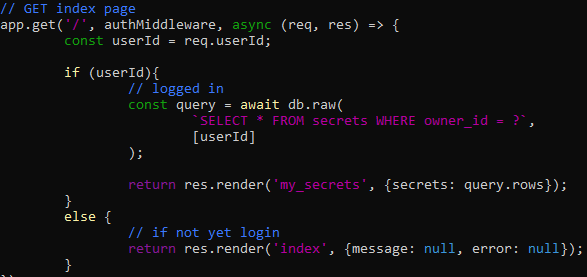

- If logged in as a user existing in the DB, we get the secrets of that user — meaning if we log in as the admin user, we get the flag. Otherwise, we remain at the index page.

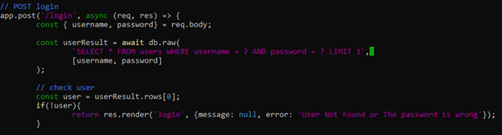

- At the `/login` endpoint, the server uses a parameterized query to handle login — meaning SQL Injection cannot be leveraged here, as the DB refuses to recompile input into an SQL query. We can only log in as a user already existing in the DB.

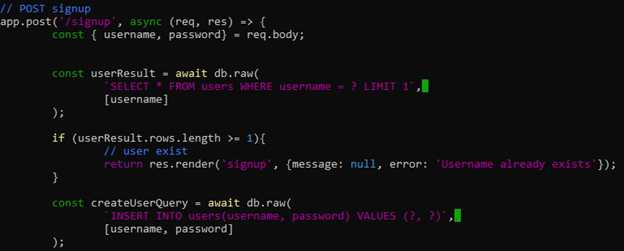

- At the `/signup` endpoint, a new valid user can be created without using any existing username in the DB. SQL injection cannot be utilized here either.
- The server ensures the DB is initialized before running.

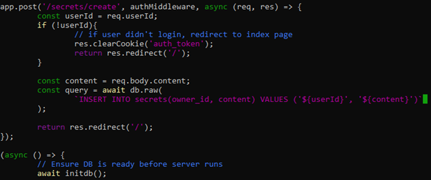

- At the `/secrets/create` endpoint, the query handling pattern clearly presents the common SQL Injection vulnerability. It is a **string concatenation mistake**: using Template Literals (`` ` `` and `${}`) concatenates the values of `userID` and `content` variables directly into a complete SQL command before sending it to the DB.

**Reviewing `db.js` reveals:**

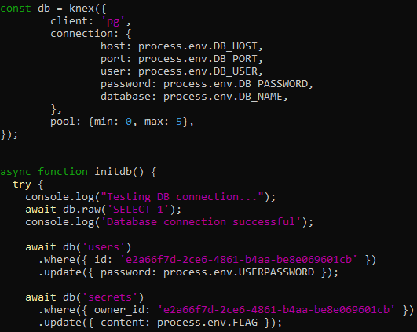

- During `initdb()`, the password (in the `users` table) and the content of the flag (in the `secrets` table) of the user with id `e2a66…` are updated from the `.env` file before the web server starts. This user is likely the admin, and the content is what we need to discover.

### 3.2. Web Application Analysis

- After signing up a new account (`username: admin2`, `password: admin`), we log in successfully and reach the secrets page.

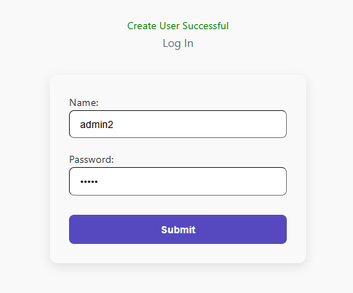

- We focus on the `/secrets/create` endpoint, identified as containing a SQL Injection vulnerability.

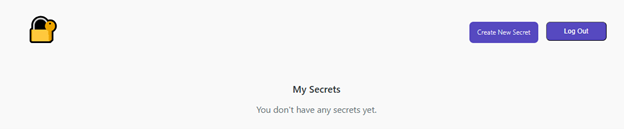

- There is a content box for entering a secret. Trying a simple string like `hello` — the `hello` string appears as a secret on the index page.

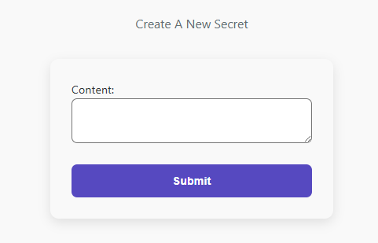

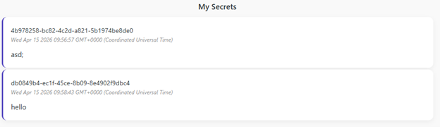

### 3.3. Database Analysis

The `initdb.sql` file was analyzed using:

```bash
strings initdb.sql
```

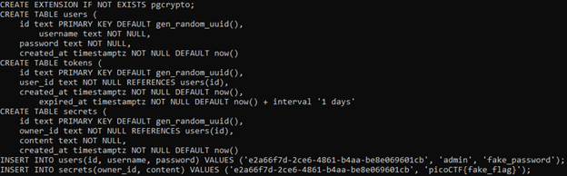

- We can confirm that the admin user's ID matches the one in `initdb()` and is generated by the `gen_random_uuid()` method of `pgcrypto` — meaning it cannot be reverse-engineered to discover the ID.

---

## 4. Exploitation & Attack Vector

### 4.1. Identify SQL Injection Type

- Based on the SQL Injection surface, we attempt a simple error-triggering string to observe how the server responds:

```
hello');
```

- The result confirms that the server is mistakenly exposing **Error-Based SQL Injection** behavior.
- Next, we determine the SQL DBMS in use with a common PostgreSQL command to retrieve its version:

```
1'); SELECT CAST((SELECT version()) AS INT) -- -
```

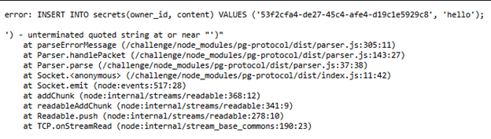

- As expected, the server responds with an error log that also discloses the DBMS version: **PostgreSQL 15.15**.

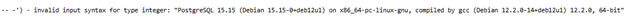

### 4.2. Retrieve Information

- After identifying PostgreSQL and the exact table/column to extract from the enumeration phase (`content` column from the `secrets` table), we use the following payload:

```
1'); SELECT CAST((SELECT content FROM secrets LIMIT 1) AS INT) -- -
```

- As expected, the server returned the flag.

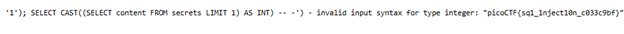

**Flag:** `picoCTF{sq1_1nject10n_c033c9bf}`

---

## 5. Root Cause Analysis

The vulnerability exists due to multiple critical design flaws:

### 5.1. Unsafe Query Construction
- Use of template literals for SQL query building
- No parameterized query usage in `/secrets/create`

### 5.2. Inconsistent Security Practices
- Some endpoints are secure (`/login`)
- Others are vulnerable (`/secrets/create`)

### 5.3. Information Disclosure
- Database error messages exposed directly to users
- Sensitive data leaked through error responses

### 5.4. Lack of Input Validation
- No sanitization or escaping of user input

---

## 6. Remediation & Best Practices

### 1. Use Parameterized Queries Everywhere

```js
db.query("INSERT INTO secrets (user_id, content) VALUES ($1, $2)", [userId, content]);
```

### 2. Disable Detailed Error Messages
- Do not expose database errors to end users
- Use generic error responses in production

### 3. Input Validation & Sanitization
- Validate all user inputs server-side
- Apply strict input constraints and type checking

### 4. Secure Development Practices
- Conduct regular code reviews
- Use static analysis tools
- Follow OWASP secure coding guidelines

### 5. Principle of Least Privilege
- Limit database user permissions
- Prevent unnecessary data exposure at the DB level
